# 🍲 RecipeHub - Sistem Informasi Resep Digital


Aplikasi mobile pencatatan resep masakan digital, dibangun dengan Flutter dan PHP Native sebagai bagian dari Ujian Akhir Semester mata kuliah **Aplikasi Nirkabel**.

---

## 📖 Deskripsi Project

**RecipeHub** merupakan aplikasi mobile berbasis Flutter yang digunakan untuk membantu pengguna menyimpan, mengelola, dan mencari resep masakan secara digital. Aplikasi ini bersifat personal, sehingga setiap pengguna hanya dapat mengelola resep miliknya sendiri. Data disimpan pada server melalui backend PHP Native dan database MySQL, dengan komunikasi data menggunakan REST API berformat JSON.

---

## ✅ Fitur

- [x] Login
- [x] Register
- [x] Dashboard (ringkasan jumlah resep & kategori)
- [x] CRUD Kategori (Tambah, Edit, Hapus, Lihat)
- [x] CRUD Resep (Tambah, Edit, Hapus, Lihat Detail)
- [x] Upload Foto Resep
- [x] Pencarian Resep
- [x] Session Login
- [x] Logout

---

## 🛠️ Teknologi

| Kategori         | Teknologi           | Keterangan                          |
|-------------------|----------------------|---------------------------------------|
| Frontend          | Flutter              | Membangun antarmuka aplikasi mobile   |
| Backend           | PHP Native            | REST API tanpa framework tambahan     |
| Database          | MySQL                 | Penyimpanan data pengguna dan resep   |
| Komunikasi Data   | HTTP REST API         | Pertukaran data berformat JSON        |
| Session           | SharedPreferences      | Menyimpan sesi login pengguna         |
| Media             | Image Picker           | Upload foto resep dari perangkat      |

---

## 📁 Struktur Folder

```
RECIPEHUB/
├── recipehub_flutter/     # Source code aplikasi Flutter (frontend)
├── recipehub-backend/     # Source code REST API PHP Native (backend)
├── database/              # File SQL untuk struktur & data database
└── APK/                   # File hasil build APK aplikasi
```

---

## 🗄️ Database

RecipeHub menggunakan **MySQL** sebagai sistem manajemen basis data untuk menyimpan seluruh data pengguna, kategori, dan resep.

### Tabel `users`
| Kolom       | Tipe Data     | Keterangan            |
|-------------|---------------|------------------------|
| id          | INT (PK)      | ID pengguna            |
| name        | VARCHAR       | Nama pengguna          |
| email       | VARCHAR       | Email pengguna (unik)  |
| password    | VARCHAR       | Password terenkripsi   |
| created_at  | TIMESTAMP     | Waktu pembuatan akun   |
| updated_at  | TIMESTAMP     | Waktu pembaruan data   |

### Tabel `categories`
| Kolom       | Tipe Data     | Keterangan                |
|-------------|---------------|-----------------------------|
| id          | INT (PK)      | ID kategori                 |
| user_id     | INT (FK)      | Relasi ke tabel users       |
| name        | VARCHAR       | Nama kategori               |
| created_at  | TIMESTAMP     | Waktu pembuatan             |
| updated_at  | TIMESTAMP     | Waktu pembaruan             |

### Tabel `recipes`
| Kolom         | Tipe Data     | Keterangan                    |
|----------------|---------------|----------------------------------|
| id             | INT (PK)      | ID resep                        |
| user_id        | INT (FK)      | Relasi ke tabel users           |
| category_id    | INT (FK)      | Relasi ke tabel categories      |
| name           | VARCHAR       | Nama resep                      |
| description    | TEXT          | Deskripsi resep                 |
| ingredients    | TEXT          | Daftar bahan-bahan               |
| steps          | TEXT          | Langkah-langkah memasak         |
| cooking_time   | INT           | Estimasi waktu memasak (menit)  |
| servings       | INT           | Jumlah porsi                    |
| image          | VARCHAR       | Path/nama file gambar resep     |
| created_at     | TIMESTAMP     | Waktu pembuatan                 |
| updated_at     | TIMESTAMP     | Waktu pembaruan                 |

---

## 🔌 REST API

Berikut daftar endpoint utama yang digunakan pada aplikasi RecipeHub.

### Autentikasi
| Method | Endpoint          | Keterangan               |
|--------|--------------------|----------------------------|
| POST   | `/auth/register`   | Registrasi akun baru      |
| POST   | `/auth/login`       | Login pengguna            |

### Dashboard
| Method | Endpoint      | Keterangan                          |
|--------|----------------|----------------------------------------|
| GET    | `/dashboard`   | Menampilkan ringkasan resep & kategori |

### Kategori
| Method | Endpoint             | Keterangan               |
|--------|------------------------|----------------------------|
| GET    | `/categories`         | Mengambil daftar kategori |
| POST   | `/categories`         | Menambahkan kategori baru |
| PUT    | `/categories/{id}`    | Mengubah data kategori    |
| DELETE | `/categories/{id}`    | Menghapus kategori        |

### Resep
| Method | Endpoint          | Keterangan             |
|--------|--------------------|--------------------------|
| GET    | `/recipes`         | Mengambil daftar resep  |
| GET    | `/recipes/{id}`    | Mengambil detail resep  |
| POST   | `/recipes`         | Menambahkan resep baru  |
| PUT    | `/recipes/{id}`    | Mengubah data resep     |
| DELETE | `/recipes/{id}`    | Menghapus resep         |

---

## 📸 Screenshot

### 🔐 Login

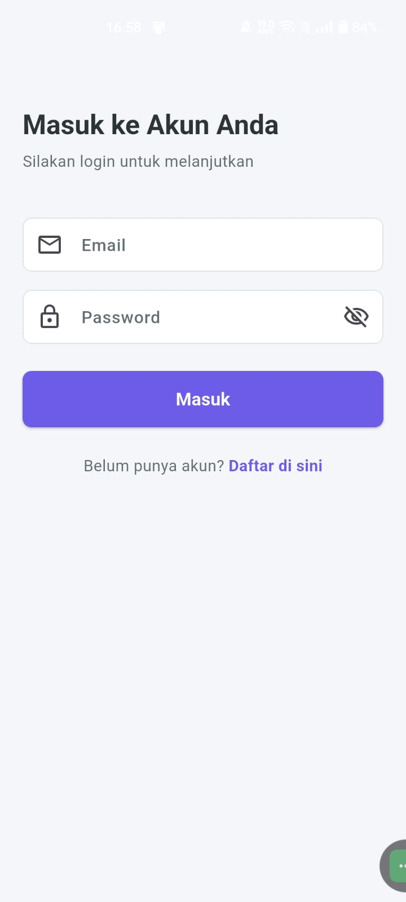

---

### 📝 Register

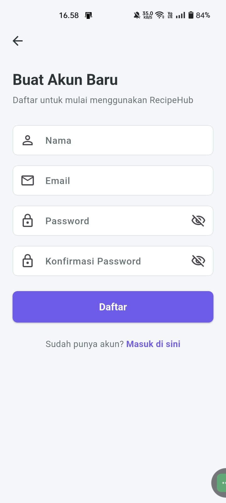

---

### 🏠 Dashboard

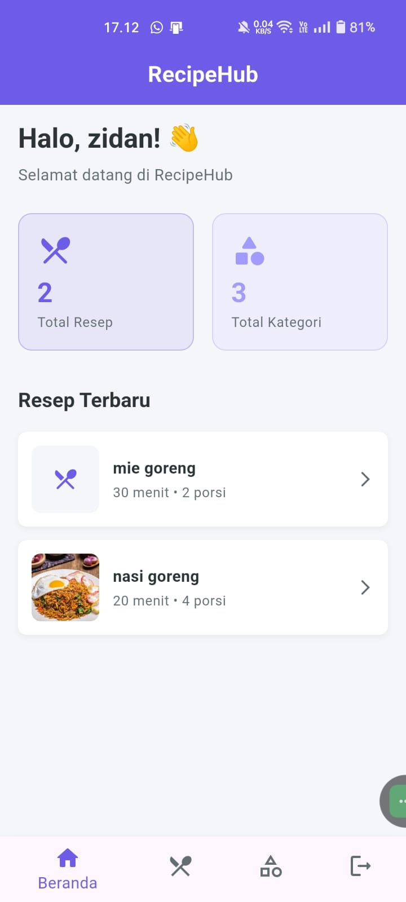

---

### 🍽️ Daftar Resep

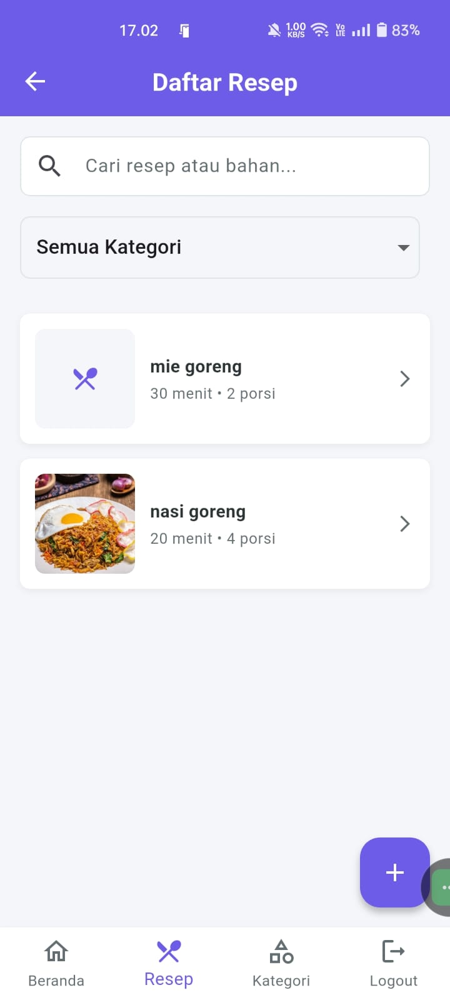

---

### ➕ Tambah Resep

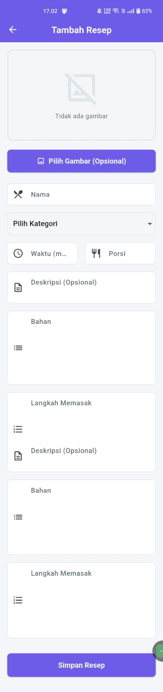

---

### 📖 Detail Resep

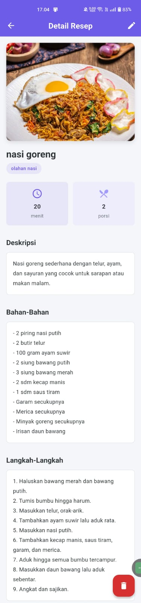

---

### ✏️ Edit Resep

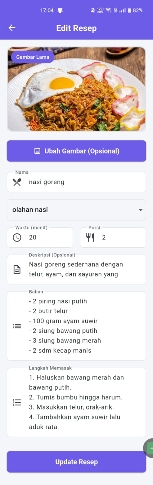

---

### 🗑️ Hapus Resep

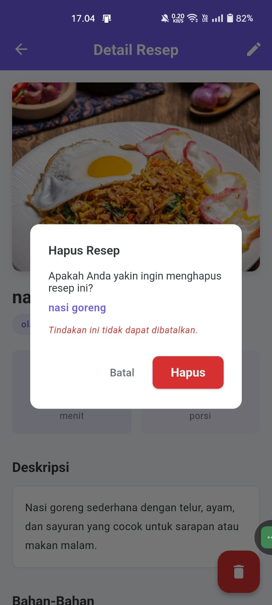

---

### 📂 Daftar Kategori

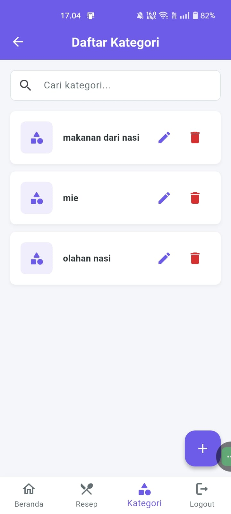

---

### ➕ Tambah Kategori

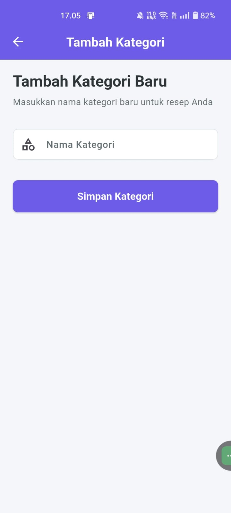

---

### ✏️ Edit Kategori

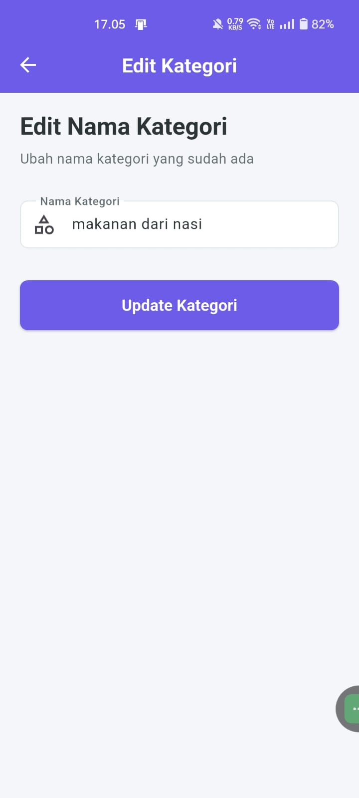

---

### 🗑️ Hapus Kategori

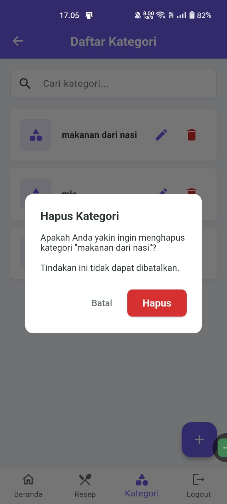

---

### 🚪 Logout

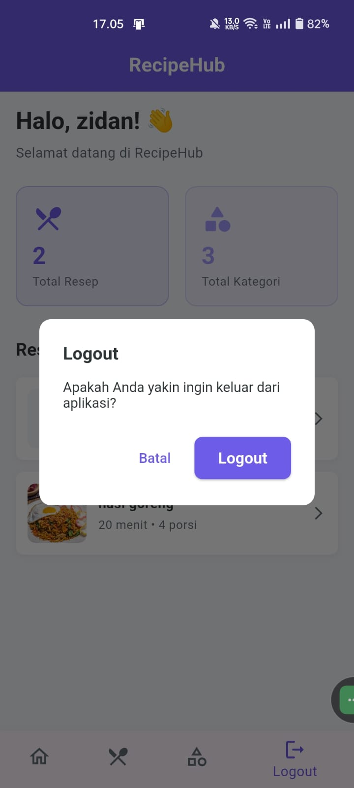

---

## 🚀 Cara Menjalankan

### Frontend (Flutter)
```bash
cd recipehub_flutter
flutter pub get
flutter run
```

### Backend (PHP Native)
1. Jalankan **XAMPP**, lalu aktifkan modul **Apache** dan **MySQL**.
2. Salin folder `recipehub-backend` ke direktori `htdocs`.
3. Buka **phpMyAdmin**, buat database baru, lalu import file `database/recipehub.sql`.
4. Sesuaikan konfigurasi koneksi database pada backend (host, username, password, nama database).
5. Pastikan aplikasi Flutter mengarah ke base URL API sesuai alamat server lokal (IP address perangkat/emulator).

---

## 📦 Build APK

```bash
flutter build apk --release
```

File hasil build dapat ditemukan pada folder:
```
recipehub_flutter/build/app/outputs/flutter-apk/app-release.apk
```
Atau tersedia langsung pada folder `APK/` di dalam repository ini.

---

## 👤 Author

| Detail            | Keterangan                          |
|--------------------|----------------------------------------|
| Nama               | Ahmad Zidan Tamimy                   |
| NIM                | 422310072                            |
| Program Studi      | Teknik Informatika                    |
| Universitas        | Sekolah Tinggi Teknologi Informasi NIIT I-Tech Jakarta |

---

## 📄 License

Proyek ini menggunakan lisensi **MIT License**.

```
MIT License

Copyright (c) 2026 Ahmad Zidan Tamimy

Permission is hereby granted, free of charge, to any person obtaining a copy
of this software and associated documentation files (the "Software"), to deal
in the Software without restriction, including without limitation the rights
to use, copy, modify, merge, publish, distribute, sublicense, and/or sell
copies of the Software, and to permit persons to whom the Software is
furnished to do so, subject to the following conditions:

The above copyright notice and this permission notice shall be included in all
copies or substantial portions of the Software.

THE SOFTWARE IS PROVIDED "AS IS", WITHOUT WARRANTY OF ANY KIND, EXPRESS OR
IMPLIED, INCLUDING BUT NOT LIMITED TO THE WARRANTIES OF MERCHANTABILITY,
FITNESS FOR A PARTICULAR PURPOSE AND NONINFRINGEMENT. IN NO EVENT SHALL THE
AUTHORS OR COPYRIGHT HOLDERS BE LIABLE FOR ANY CLAIM, DAMAGES OR OTHER
LIABILITY, WHETHER IN AN ACTION OF CONTRACT, TORT OR OTHERWISE, ARISING FROM,
OUT OF OR IN CONNECTION WITH THE SOFTWARE OR THE USE OR OTHER DEALINGS IN THE
SOFTWARE.
```
